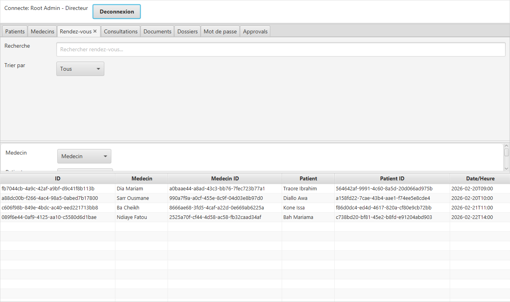
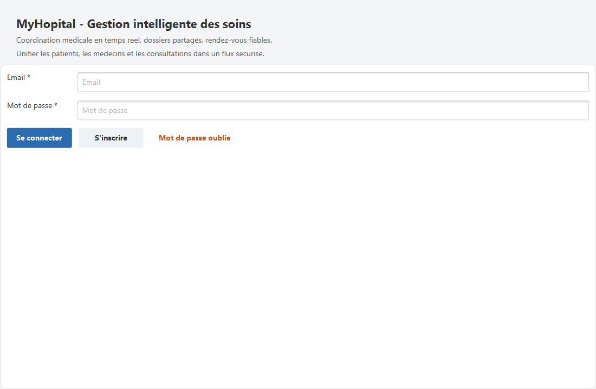
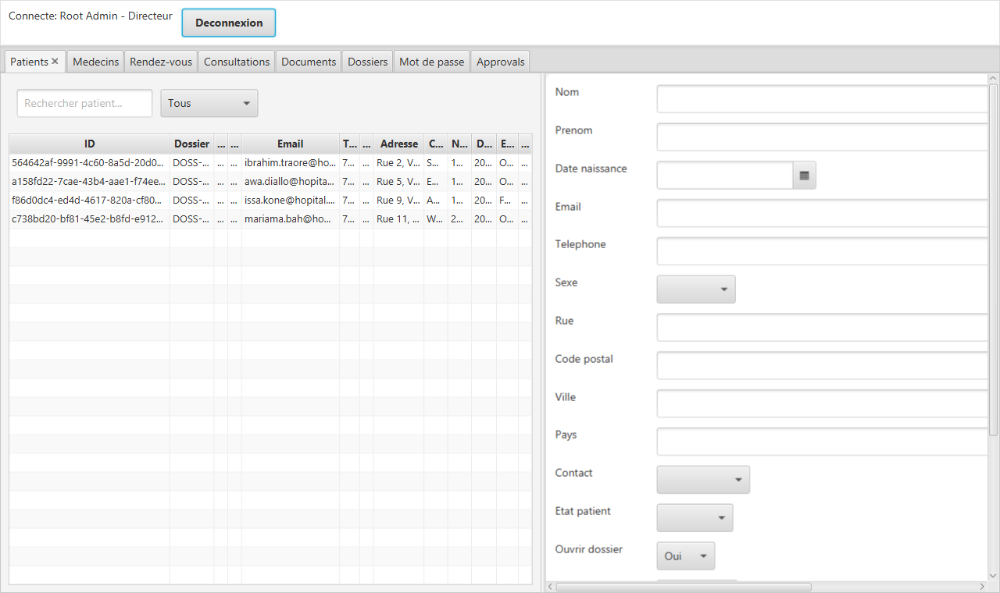

# MyHopital

Prototype desktop de gestion d'hopital en JavaFX. L'application couvre l'authentification avec roles, la gestion des patients et medecins, les rendez-vous, les consultations, les dossiers medicaux et les documents. Elle est pensee pour l'apprentissage : architecture claire, separation des couches, donnees de demonstration et base SQLite locale.

[](https://github.com/rivaldopiaplle-boop/myhopital/actions/workflows/ci.yml)

**Telecharger** : page [Releases](https://github.com/rivaldopiaplle-boop/myhopital/releases/latest).
Windows : decompresser `MyHopital-windows.zip`, puis lancer `MyHopital.exe`. Linux :
`sudo apt install ./MyHopital-linux.deb`. Java est embarque : rien d'autre a installer.

Portfolio : https://git-portfolio-rivaldo.vercel.app/projets/hopital-java



| Connexion | Patients |
|---|---|
|  |  |

---

## 0) Qualite : ce qui est verifie

- **Mots de passe haches** avec PBKDF2-HMAC-SHA256 (fourni par Java), un sel par compte,
  comparaison en temps constant. Une base creee avant le hachage reste utilisable : le
  mot de passe en clair est remplace par son hache a la premiere connexion reussie.
- **11 tests JUnit**, dont 6 contre une vraie base SQLite temporaire : hachage,
  connexion, changement de mot de passe, approbation d'un second directeur, emails
  refuses. Ils tournent a chaque poussee (GitHub Actions).
- **Un defaut trouve par les tests** : l'inscription d'un second directeur echouait,
  car sa demande d'approbation etait enregistree avant lui (cle etrangere). L'ordre
  est corrige.
- **Versions publiees automatiquement** : une etiquette `v*` construit, avec `jpackage`,
  l'application Windows et le paquet Linux, et les joint a la version.
- **Captures reproductibles** : `CaptureEcrans` (code de test) monte l'application sur
  une base temporaire et photographie chaque ecran.

---

## 1) Ce que fait le projet

### Fonctions principales
- Acces par role : Directeur, Gestionnaire, Medecin
- Gestion des patients, medecins, rendez-vous, consultations, dossiers et documents
- Validation des donnees (formats email, champs obligatoires)
- Reinitialisation du mot de passe via code temporaire
- Workflow d'approbation pour les comptes Directeur
- Donnees persistantes dans SQLite, avec import initial depuis des CSV

### Pourquoi ce projet est utile
- Apprendre une architecture propre (UI -> Service -> Repository -> Domain)
- Comprendre les flux CRUD (Create, Read, Update, Delete)
- S'exercer a la persistance locale (SQLite) sans serveur externe
- Explorer JavaFX avec des ecrans concrets et de vrais cas metiers

---

## 2) Prerequis

- Java 17+ (JDK)
- Maven 3.8+
- Un systeme Windows/Linux/macOS avec un terminal

---

## 3) Lancer l'application

Commande simple :

```bash
mvn -q -DskipTests javafx:run
```

Si tout se passe bien, la fenetre JavaFX s'ouvre et vous pouvez vous connecter.

---

## 4) Comptes de demonstration

Utilisez ces identifiants pour tester rapidement :

- Directeur : admin@hopital.local / admin
- Gestionnaire : agent@hopital.local / agent
- Medecin : medecin@hopital.local / medecin

Conseils :
- Tapez tout en minuscules
- Evitez le copier-coller (risque d'espaces invisibles)

---

## 5) Donnees et base SQLite

### Stockage
- La base SQLite est creee automatiquement dans myhopital.db, dans le dossier de lancement. Elle n'est pas versionnee : supprimee, elle se recree avec les donnees de demonstration.
- Au premier demarrage (base vide), les CSV sont importes puis la base devient persistante.
- Les listes en memoire (ObservableList) servent a l'affichage et a la reactivite de l'UI.

### Donnees de demo (CSV)
- src/main/resources/data/patients.csv
- src/main/resources/data/medecins.csv
- src/main/resources/data/rendezvous.csv
- src/main/resources/data/consultations.csv
- src/main/resources/data/documents.csv

### Variables de configuration possibles
- DB_URL (defaut : jdbc:sqlite:myhopital.db)
- DB_USER (defaut : vide)
- DB_PASSWORD (defaut : vide)
- DB_DRIVER (defaut : org.sqlite.JDBC)

---

## 6) Structure du projet (vue rapide)

```
myhopital/
	src/main/java/com/rivaldo/hopital/
		app/         -> point d'entree applicatif JavaFX
		config/      -> configuration et bootstrap
		domain/      -> modele metier (Patient, Medecin, Utilisateur...)
		exception/   -> exceptions metier
		repository/  -> persistance SQLite + DataStore memoire
		service/     -> logique metier
		ui/          -> ecrans JavaFX
		util/        -> outils (CSV, date/heure, generateur d'ID)
	src/main/resources/
		application.css
		data/        -> CSV de demo
		web/         -> page web simple de demo
```

Pour un detail complet, voir la documentation :
- DEMARRAGE_RAPIDE.md (parcours pas a pas)
- EXPLICATION_COMPLETE_PROJET.md (comprendre toute l'architecture)
- GUIDE_PROJET_COMPLET.md (toute l'arborescence expliquee)
- SCHEMAS_VISUELS.md (schemas textuels)
- INDEX.md (table des matieres globale)

Nouveaux chapitres ajoutes :
- Atelier pratique (exercices pas a pas)
- Debug + erreurs frequentes
- Evolution du projet (pistes futures)

Ajouts supplementaires :
- Debug avance (methodologie + cas concrets)
- Atelier complet CRUD (patients, RDV, consultations)
- CONTRIBUTING.md (guide de contribution)

---

## 7) Probleme frequents et solutions

### Connexion qui echoue
- Verifiez email/mot de passe en minuscules
- Evitez les espaces au debut/fin
- Utilisez les comptes de demo

### La base ne se cree pas
- Verifiez les droits d'ecriture a la racine du projet
- Supprimez myhopital.db pour forcer un nouveau demarrage propre

### Ecran vide ou table vide
- Premiere execution : laissez l'import CSV se terminer
- Verifiez que les fichiers CSV existent dans src/main/resources/data

---

## 8) Commandes utiles

```bash
mvn -B verify                      # compiler et jouer les tests
mvn -q -DskipTests javafx:run      # lancer l'application
mvn -B package                     # jar et dependances dans target/libs (pour jpackage)
```

---

## 9) Licence

MIT
